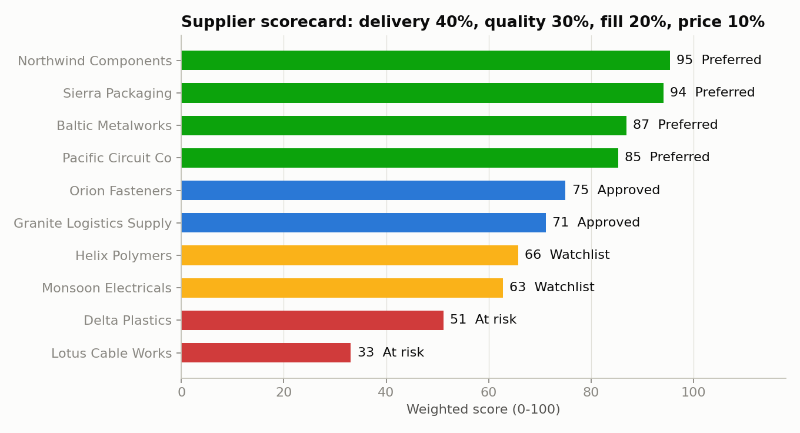
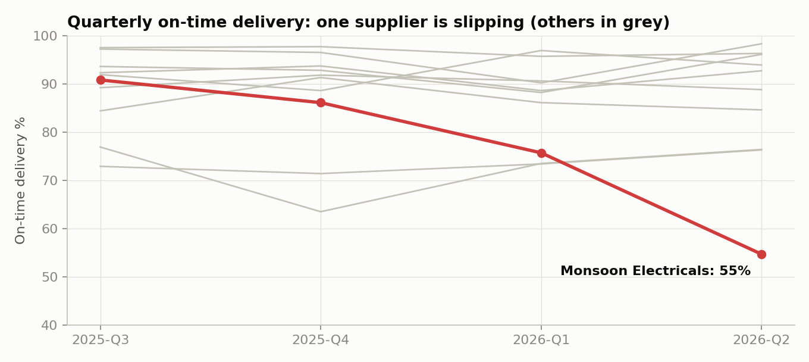

# VendorPulse: Supplier Performance Scorecard

Ranks 10 suppliers on delivery, quality, fill rate and price using SQL over 3,000 purchase orders, then flags which suppliers need attention and which one is getting worse.

Built with SQL (SQLite) and Python (pandas, matplotlib). The output CSVs load directly into Power BI or Excel.

> **Data note:** the dataset is synthetic. `src/build_database.py` simulates a year of purchase orders and receipts with a fixed seed. Supplier names are made up, and the numbers are reproducible but not from a real company.

## The question it answers

A sourcing team reviewing its supplier base needs to know: *who is performing, who is not, and where is our spend exposed?* Raw purchase-order data does not answer that until it is turned into comparable KPIs and one score per supplier.

## Results



| Rank | Supplier | Score | Tier | On-time % | Defect PPM | Fill rate % | Price vs contract |
|---|---|---|---|---|---|---|---|
| 1 | Northwind Components | 95.4 | Preferred | 96.8 | 4,063 | 99.9 | +0.05% |
| 2 | Sierra Packaging | 94.1 | Preferred | 95.3 | 3,101 | 99.4 | +0.17% |
| 3 | Baltic Metalworks | 86.9 | Preferred | 92.8 | 6,117 | 99.5 | +1.07% |
| 4 | Pacific Circuit Co | 85.3 | Preferred | 91.8 | 7,908 | 99.4 | -1.88% |
| 5 | Orion Fasteners | 75.0 | Approved | 90.0 | 10,133 | 98.9 | +1.93% |
| 6 | Granite Logistics Supply | 71.2 | Approved | 86.8 | 7,151 | 98.8 | +2.95% |
| 7 | Helix Polymers | 65.8 | Watchlist | 92.8 | 20,026 | 99.6 | +4.76% |
| 8 | Monsoon Electricals | 62.8 | Watchlist | 77.0 | 9,017 | 99.0 | -0.17% |
| 9 | Delta Plastics | 51.2 | At risk | 73.4 | 15,033 | 98.8 | -2.83% |
| 10 | Lotus Cable Works | 33.1 | At risk | 72.6 | 30,133 | 98.2 | -4.03% |

What the scorecard shows:

- **41.7% of spend sits with Watchlist or At-risk suppliers.**
- **The cheapest supplier is the worst performer.** Lotus Cable Works bills 4% under contract price but is late on more than a quarter of orders and has the highest defect rate.
- **A yearly average hides a supplier in decline.** Monsoon Electricals averages 77% on time for the year, but fell from 90.8% in its first quarter to 54.7% in its last. The quarterly trend query catches this.
- **Helix Polymers delivers on time but fails on quality and price**, so a delivery-only view would rate it as a good supplier.



## How it works

**Data model** (SQLite, `data/procurement.db`):

```
suppliers        supplier_id, supplier_name, region, category
purchase_orders  po_id, supplier_id, order_date, promised_date, qty_ordered, contract_price, unit_price
receipts         receipt_id, po_id, received_date, qty_received, qty_rejected
```

**SQL** (`sql/`):

| File | What it does | SQL used |
|---|---|---|
| `01_supplier_kpis.sql` | On-time %, lead time, days late, defect PPM, fill rate and price variance per supplier | joins, aggregates |
| `02_scorecard.sql` | Converts each KPI to a 0-100 score, weights them, ranks and tiers suppliers | CTEs, `CASE`, `RANK()`, window `SUM() OVER` |
| `03_quarterly_trend.sql` | On-time % by quarter with change vs. the prior and first quarter | `LAG()`, `FIRST_VALUE()`, `PARTITION BY` |

**Scoring.** Each KPI is scaled to 0-100 against a target, then weighted:

| KPI | Weight | Scores 100 at | Scores 0 at |
|---|---|---|---|
| On-time delivery | 40% | 95% or better | 65% |
| Quality (defect PPM) | 30% | 0 PPM | 30,000 PPM |
| Fill rate | 20% | 100% | 95% |
| Price vs contract | 10% | at or below contract | 5% over |

Tiers: Preferred (85+), Approved (70-84), Watchlist (55-69), At risk (below 55). The weights and targets are assumptions set at the top of `02_scorecard.sql` and can be changed there.

## Run it

```bash
python -m venv .venv && source .venv/bin/activate
pip install -r requirements.txt
python src/build_database.py   # writes data/procurement.db
python src/scorecard.py        # runs the SQL, writes outputs/
```

## Project layout

```
data/      procurement.db (generated)
sql/       the three queries
src/       build_database.py, scorecard.py
outputs/   supplier_kpis.csv, scorecard.csv, quarterly_trend.csv, charts
```

## Limitations

- The data is simulated, with supplier differences built in on purpose, so the findings show the method working rather than a real result.
- Each purchase order has one receipt. Real data has partial and split deliveries.
- The weights and targets are assumptions. In practice they would be agreed with the sourcing team.
